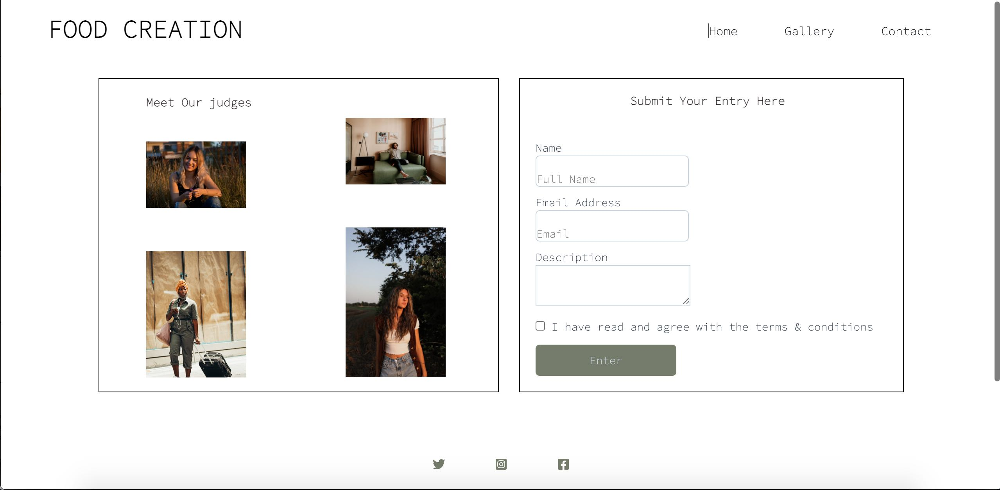

# FOOD CREATION 
* This website is a site that helps people to show their talent
* and can also be a positive influence to the audience watching.
* This competition site is for every age group both young and old, as long as you are have talent in cooking, 
* Its message is targeted at people of all race, color and age.

## Features 
https://app.moqups.com/UdpDxXllgOvSONBG8ui6qWXXgt4hV6HQ/view/page/a44548bef?ui=0&fit_width=1

* The Food Creation website features links for users to be able to navigate around, HOME, GALLERY AND SIGNUP FORM PAGE
* There is also a link to social media where users can learn more about the competition
* Interact with other contestants.
* Full view of the all the pages of Food Creation website is added above.

### Home

* The home page features navigation links that can help the user move around the website.
* list of the navigation is stated below. it display a navigation quick link to take users to where they can register for the competition and to social media page.

* Home
* About
* Gallery
* Contact

### About
* A short description of text about the competition is displayed on the ABOUT US column on the Home Page.
* It explains the relevant and benefit of the competition so that the user can learn the details of the competition. 

### Gallery

* This page displays images and description of dishes to submit as part of the eligibility to participate in the competition. 
* Social media link and navigation link is also included for easy navigation.

### Contact

* The contact page is where users can fill in their information to register for the competition and also see the judges that are taking part in the competition. 
* It also include links to social media and you user can navigate back to other pages within the website.
* The registration include the user full names, emaill adress and description of the submited food.

## Testing
* HTML
* Nu Html Checker is use to test for errors
* 5 errors and 2warnings is found
* End Tag error from line 53, column 5; to line 53, column 14
* unclosed element (div) from From line 34, column 13; to line 34, column 31
* From line 33, column 9; to line 33, column 32
* Stray start tag (script) from line From line 77, column 1; to line 77, column 80
* i got warning on using H1 element as a top level heading only

CSS
*
