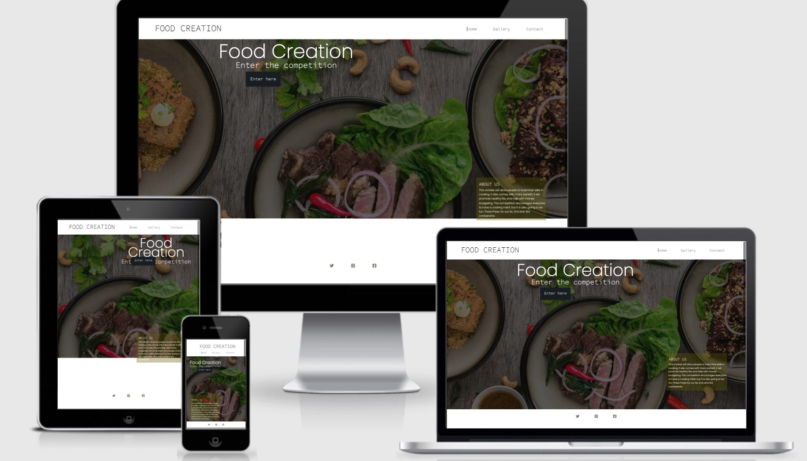
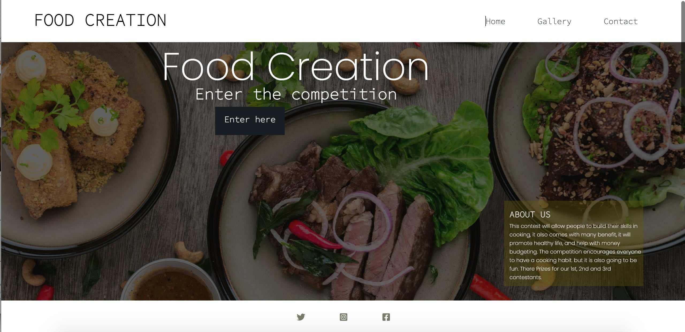
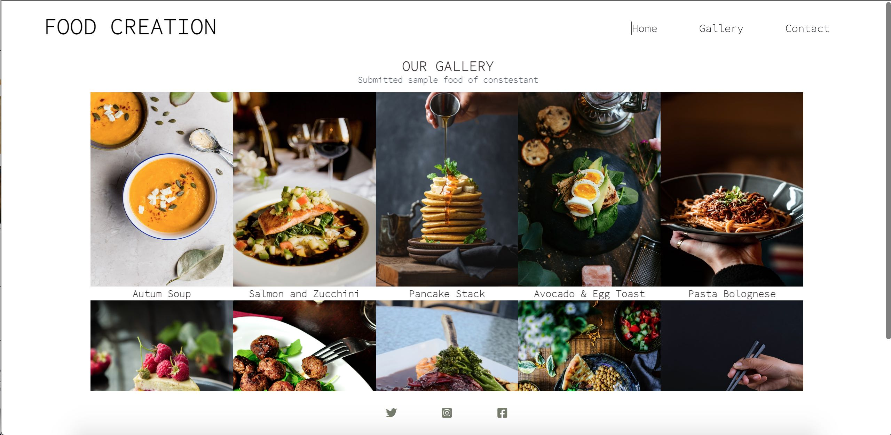
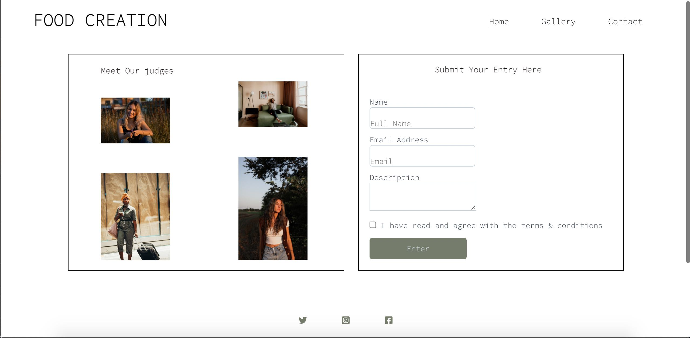

# [FOOD CREATION]( https://ejiro-design.github.io/food-creation/)
* This website was build for 2 diffent type of device, macbook pro 13inch and iphone5/SE 
* This website is a site that helps people to show their talent
* and can also be a positive influence to the audience watching.
* This competition site is for every age group both young and old, as long as you are have talent in cooking, 
* Its message is targeted at people of all race, color and age.

## User Stories
* Users will be able to navigate around the website easily using the navigation link
* The site features different aspect of the site, which is the home, Gallery and contact page
* Users with cooking talent will benefit by registering and entering the competition

## Features 
### Home: 
* The home has a lovely background image of food that welcomes a user and the enter button will take the user to the registration form
* A short description of text about the competition is displayed on the ABOUT US column on the Home Page.

### Gallery: 
* This page displays images and description of dishes to submit as part of the eligibility to participate in the competition. 
* Social media link and navigation link is also included for easy navigation.

### Contact: 
* Contact page has a photo of the judges and the contact form is use for registration 
* The contact page is where users can fill in their information to register for the competition and also see the judges that are taking part in the competition. 
* It also include links to social media and you user can navigate back to other pages within the website.
* The registration include the user full names, emaill adress and description of the submited food.

## Features future
* An dditional link to display list of winners will be added in the future

## Typography and Colour Scheme
* The color used for the site basically black

## Technology
* Githpod was used to for the design

## Validator Testing
### HTML
* Nu Html Checker is use to test for errors 
* 5 errors and 2warnings is found
* End Tag error from line 53, column 5; to line 53, column 14
* unclosed element (div) from From line 34, column 13; to line 34, column 31
* From line 33, column 9; to line 33, column 32
* Stray start tag (script) from line From line 77, column 1; to line 77, column 80
* i got warning on using H1 element as a top level heading only
* moved footer script to the body

### CSS
* list of errors found below using the (Jigsaw) validator
* value error on font in line 17
* value error on padding in line 80
* value error on position in line 133
* value error on padding and unit in line 349
* value error on width and unit in line 418
* add quoting to family name on line 10, 79, 133, 140 and 215

## Fixed bugs
* all errors where fixed for css files using the (W3Cvalidator)
* all errors where fixed for html files using the ( (Jigsaw validator)

## Deployment
* Opened github repository
* opened food creation
* clicked on setting
* clicked on pages on the side menu
* navigate to source and clicked on main
* the site link was published

## Supported Screen and Browser
* The site is supported by all screens and browser

## CREDIT
### Content
* Icons in the footer was gotten from FONT AWESOME
* website idea from SQUARESPACE
* i was able to link success page with the help of CODEPEN.IO site

## Media
* Photos/images was where taken from UNSPLASH.com
